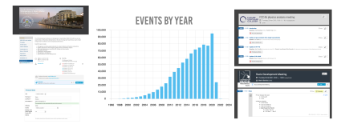
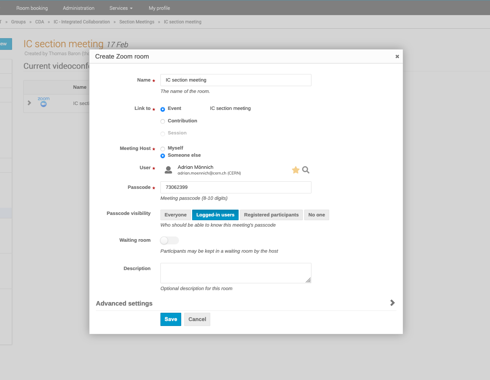
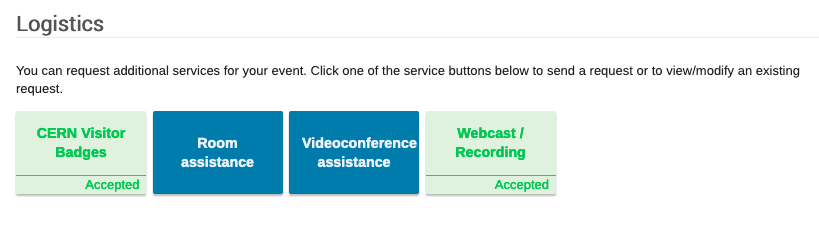
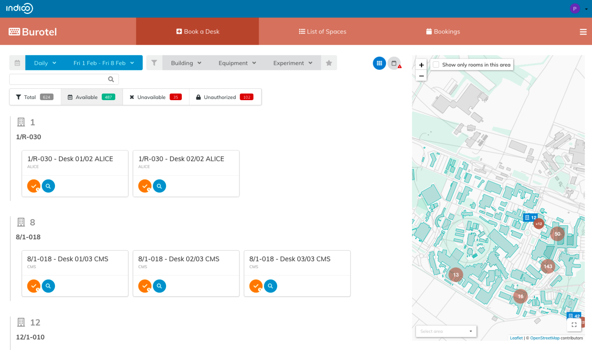
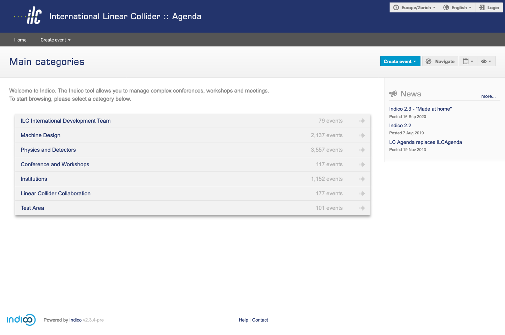
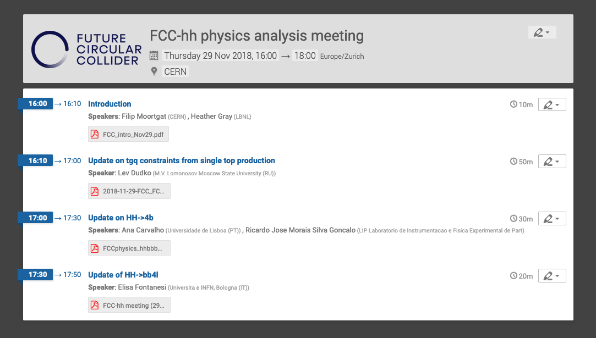

<!-- _footer: '' -->

---

*from* **CERN** *to the* 🌍

### Pedro Ferreira (CERN), Dominic Hollis (CERN)

<!-- _footer: CC BY-NC-SA 4.0 • Indico and CERN logos: © Copyright CERN • https://git.io/JtQmL -->

---

### 

 - **Event Management** System
 - Core Developed at **CERN**
 - **Collaborative effort** - Open Source
 - \> **70 developers** over the years
 - ~ **250 servers** world wide <!-- TODO -->

---

### Community

 <!-- TODO -->

---

### History

 - **1999** - **CDS Agenda**
 - **2002** - **EU Project**
 - **2004** - First **Conference**
 - **2007** - **Room Booking**
 - **2009** - **Video Conferencing**
 - **2013** - First **Workshop**
 - **2015** - **UNOG** starts using it
 - **2017** - Indico 2.0 (**rewrite**)
 - **2021** - Indico 3.0 (**Python 3**)
 - **2023** - **1 Million Events** surpassed at CERN 🎉

---

### Open Source

- Free **redistribution**
- Distributed **peer review**
- **Transparency**
- **Community** with common goals

---

### Open Source

- Powering most of the internet
  - MongoDB, ElasticSearch, MySQL, PostgreSQL, Apache, **Linux**...
- **CERN** was a pioneer
  - World Wide Web
  - Indico, Invenio, ROOT...

---

<!-- _footer: © Copyright CERN --->

---

<!-- _footer: © Copyright 2018-2020 CERN --->

---

### CERN

- **~17.000** people on campus <!-- 2022 stats -->
- **~230** meeting rooms
- **100.000+** events/year
  * **1.000.000+** events total
- (Distributed) Meetings
- Conferences, workshops

---

### Adoption at CERN

---

---

---

### Philosophy

 - "Agnostic" **core**
 - Extension through **plugins** 🧩
 - **Themes** 🎨 (customization)

---

### Extensions

 - Video conferencing 📹
 - Payment Systems 💰
 - Automatic conversion to PDF 🖨
 - Search 🔎
 - Storage 💾
 - URL Shortening 👉
 - Internal Workflows (e.g. recording, visitors)

---

### Zoom

---

https://github.com/indico/indico-plugins/tree/master/vc_zoom

---

### Electronic Payment

---

### Workflows

---

### Access Registration

---

### Webcast / Recording

---

### Hotdesks

---

### Themes / Customization

---

### Themes / Customization

---

### Themes / Customization

---

### Conclusion
 - Extensible event management system
 - Open Source
 - Mature and actively maintained
 - Ecosystem of plugins: official + 3rd party
 - Thriving community
 - **Everyone is welcome**!

---

### [getindico.io](https://getindico.io)
####  [@getindico](https://twitter.com/getindico)

---

<!-- _footer: '' -->
<!-- _paginate: false -->

