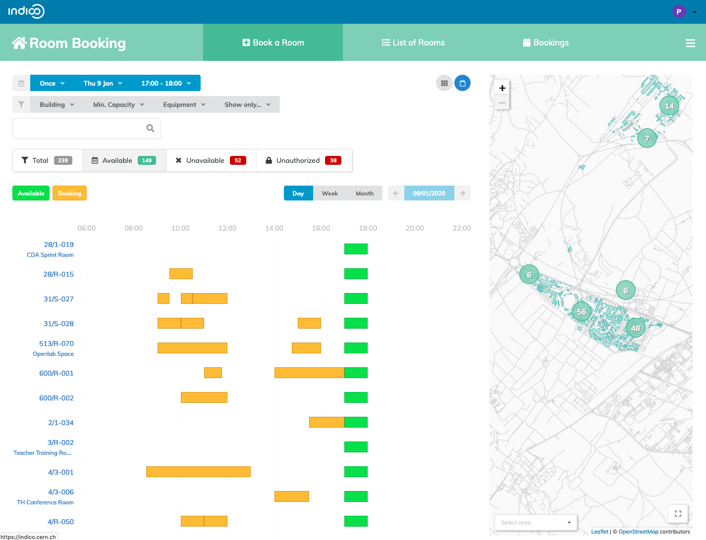
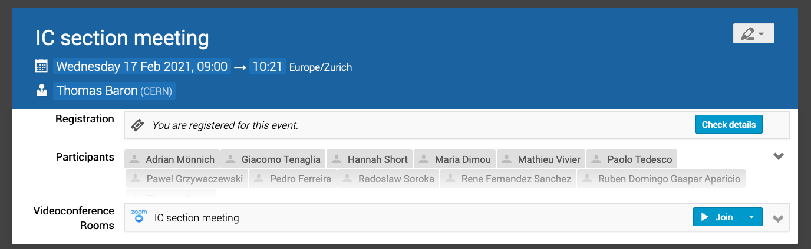
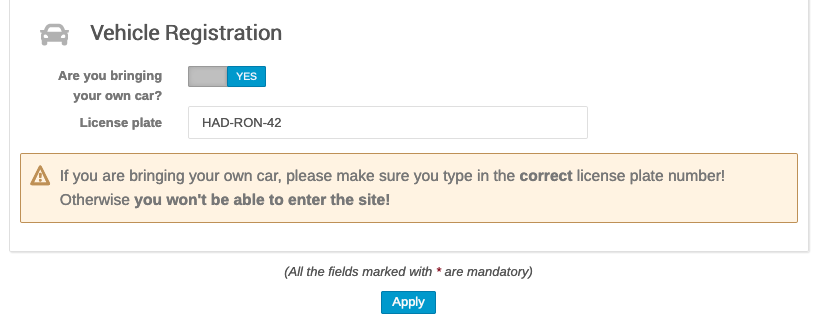
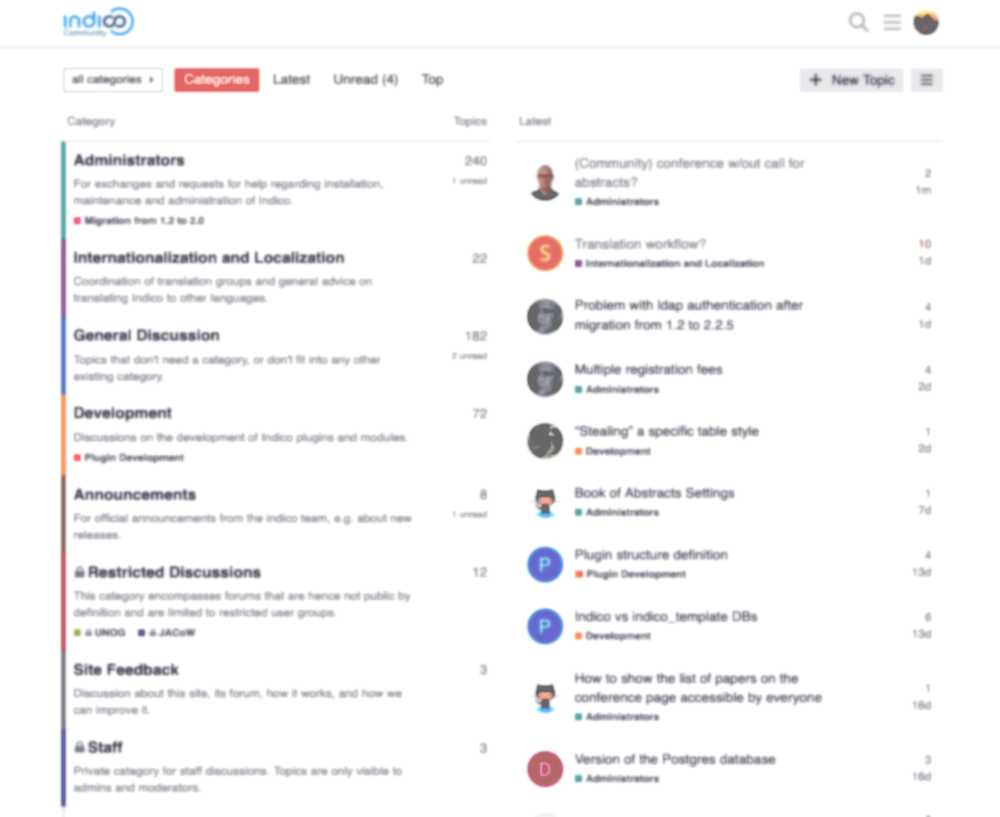

<!-- _footer: '' -->

---

*from* **CERN** *to the* 🌍

### Pedro Ferreira (CERN)

---

### 

 - **Event Management** System
 - Core Developed at **CERN**
 - **Collaborative effort** - Open Source
 - \> **70 developers** over the years
 - \> **150 servers** world wide

---

### History

 - **1999** - **CDS Agenda**
 - **2002** - **EU Project**
 - **2004** - First **Conference**
 - **2007** - **Room Booking**
 - **2009** - **Video Conferencing**
 - **2013** - First **Workshop**
 - **2015** - **UNOG** starts using it
 - **2017** - Indico 2.0 (**rewrite**)

---

### Philosophy

 - "Agnostic" **core**
 - **Plugins** 🧩
 - **Themes** 🎨
 - Developed **publicly**

---

### CERN

- **~10.000** people on campus
- **~230** meeting rooms
- **~80.000** events/year
- (Distributed) Meetings
- Conferences, workshops

---

---

---
### Plugins

 - Video conferencing 📹
 - Payment Systems 💰
 - Automatic conversion to PDF 🖨
 - Search 🔎
 - Storage 💾
 - URL Shortening 👉
 - Internal Workflows (e.g. recording, visitors)

---

---

---

---

### Conclusion
 - Extensible event management system
 - Open Source
 - Mature and actively maintained
 - Ecosystem of plugins: official + 3rd party
 - Thriving community
 - **Everyone is welcome**!

---

### [getindico.io](https://getindico.io)
####  [@getindico](https://twitter.com/getindico)

---

<!-- _footer: '' -->
<!-- _paginate: false -->

