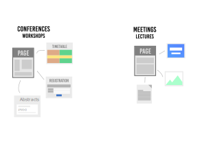

<!-- _footer: '' -->

---

*an event management system*

### Pedro Ferreira, Dominic Hollis (CERN)

<!-- _footer: CC BY-NC-SA 4.0 • Indico and CERN logos: © Copyright CERN • https://cern.ch/ind-fos-24 -->

---

### 

 - **Event Management** System
 - **Collaborative effort** - MIT License
 - Core Developed at **CERN**
 - With contributions from the **United Nations**, **Max-Planck Institute for Physics** and many others!
 - **70+ developers** over the years

---

*The most popular event management system you never heard about*

 - **300+ servers**
 - **> 350K users**
 - Initial growth in research, but growing beyond it
   - [indico.un.org](https://indico.un.org)
   - [events.canonical.org](https://events.canonical.com/)
   - [indico.gnome.org](https://indico.gnome.org)
   - [lpc.events](https://lpc.events)

---

### History

 - **1999** - **CDS Agenda**
 - **2002** - **EU Project**
 - **2004** - Indico in **Production**
 - **2007** - **Room Booking**
 - **2008** - **Interface overhaul**
 - **2013** - First **Workshop**
 - **2015** - The **UN** starts using it
 - **2017** - Indico 2.0 (**rewrite**)
 - **2021** - Indico 3.0 (**Python 3**)
 - **2023** - **1 Million Events** surpassed at CERN 🎉
 - **2024** - **20 years!**

---

<!-- _footer: © Copyright CERN --->

---

<!-- _footer: © Copyright CERN --->

---

### FOSS at CERN

- Open science is at the core of CERN's mission
- Indico, Invenio, Zenodo, ROOT, ...
- CERN Open Hardware Licence (CERN OHL)
- CERN OSPO (Open Source Program Office)

*also **using** a lot of FOSS!*

---

### A bit of publicity...

- **Sat 13:30 - K.3.201** - CERN's Open Source Storage Systems
- **Sat 14:20 - K.3.201** - CephFS at CERN in view of Disaster Recovery
- **Sat 16:00 - UB4.132** - Unlocking Research Data Management with InvenioRDM

---

### CERN

- **~17.000** people on campus <!-- 2022 stats -->
- **~230** meeting rooms
- **100.000+** events/year
  * **1.000.000+** events total
- (Distributed) Meetings
- Conferences, workshops

---

### Adoption at CERN

---

---

---

### Philosophy

 - "General purpose" **core**
 - Extension through **plugins** 🧩
 - **Themes** 🎨 (customization)

---

### Under the Hood

 - Python 3 🐍
 - PostgreSQL 🐘
 - Flask
 - Celery
 - SQLAlchemy
 - React
 - Semantic UI React
 - *among many others!*

---

### Extensions

 - Video conferencing 📹
 - Payment Systems 💰
 - Automatic conversion to PDF 🖨
 - Search 🔎
 - Storage 💾
 - URL Shortening 👉
 - Internal Workflows (e.g. recording, visitors)

---

### Zoom

---

### Electronic Payment

---

### Workflows

---

### Access Registration

---

### Recording of Events

---

### Hot desking

---

### Themes / Customization

---

### Themes / Customization

---

### Themes / Customization

---

### Check-in App (PWA)

---

### Conclusion
 - Extensible event management system
 - Open Source
 - Mature and actively maintained
 - Ecosystem of plugins: official + 3rd party
 - Thriving community
 - **Everyone is welcome**!

---

### [getindico.io](https://getindico.io)

 [@getindico@fosstodon.org](https://fosstodon.org/@getindico)
 [@getindico](https://twitter.com/getindico)
 [@#indico:matrix.org](https://app.element.io/#/room/#indico:matrix.org) / indico@libera.chat

---

<!-- _footer: '' -->
<!-- _paginate: false -->

