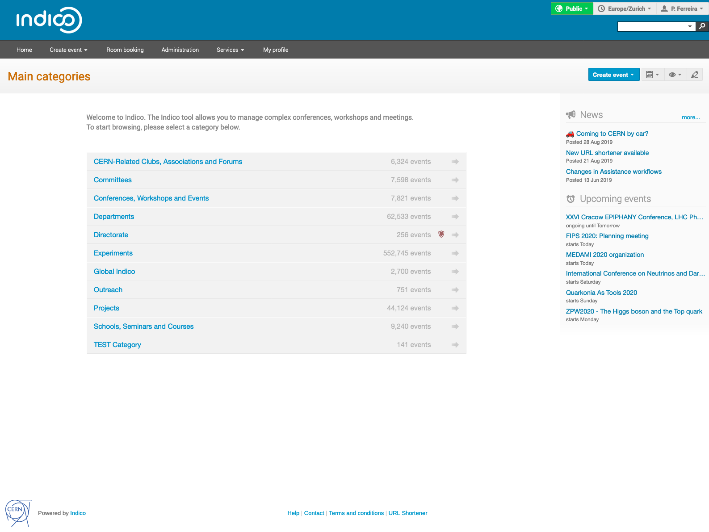

<!-- _footer: '' -->


---


*An Event Management Platform*

### Pedro Ferreira & Adrian Mönnich (for the Indico Team)

<style scoped>
h3 {
    color: #aaa;
    font-size: 0.8em;
    font-weight: normal;
}
</style>

<!-- _footer: CC BY-NC-SA 4.0 • Indico and CERN logos: © Copyright CERN -->

---



### 

 - **Event Management** System
 - Developed at **CERN**
 - **Collaborative effort** - Open Source
 - \> **70 developers** over the years
 - \> **150 servers** world wide

---


### History

 - **1999** - **CDS Agenda**
 - **2002** - **EU Project**
 - **2004** - First **Conference**
 - **2007** - **Room Booking**
 - **2009** - **Video Conferencing**
 - **2013** - First **Workshop**
 - **2015** - **UNOG** starts using it
 - **2017** - Indico 2.0 (**rewrite**)
 - **2019** - Modern ES and React

<style scoped>
section {
    font-size: 1.7em;
}
</style>

---


---


---

### (Some of the) Data we store

- Event title, location, organizers, participants, timetable (talks)…
- Abstract/Talk submitters, speakers, authors, reviewing data…
- Lots of attached files;
- User names, e-mails, affiliations…
- Participant registration data (can be anything);
- *and so on…*

---

### Metadata

- JSON-based REST API
- OpenGraph for Thumbnails
- Basic schema.org ontologies (JSON-LD + Microdata)

---

Events

```json
{
    "@context": "http://schema.org",
    "@type": "Event",
    "name": "CERN-Solid brainstorming meeting",
    "startDate": "2020-02-07T10:00:00+01:00",
    "endDate": "2020-02-07T16:55:00+01:00",
    "description": "The aim of this first brainstorming meeting is to exchange technical information …",
    "location": {
        "@type": "Place",
        "address": "No address set",
        "name": "CERN"
    },
    "performer": [
        {
            "@type": "Person",
            "affiliation": {
                "@type": "Organization",
                "name": "CERN"
            },
            "name": "Maria Dimou"
        }
    ],
    "url": "https://indico.cern.ch/event/866085/"
}
```

<style scoped>
code {
    font-size: 0.7em;
}
</style>

---

Breadcrumbs

```html
<div class="main-breadcrumb " itemprop="breadcrumb" itemscope="" itemtype="http://schema.org/Breadcrumb">
    <span class="path" itemscope="" itemtype="http://schema.org/BreadcrumbList">
        <span itemprop="itemListElement" itemscope="" itemtype="http://schema.org/ListItem">
            <a href="/" itemprop="item" class="item">
                <span itemprop="name">Home</span>
            </a>
            <meta itemprop="position" content="1">
        </span>
        <span class="sep">»</span><span itemprop="itemListElement" itemscope="" itemtype="http://schema.org/ListItem">
            <a href="/category/6742/" itemprop="item" class="item">
                <span itemprop="name">Projects</span>
            </a>
             <meta itemprop="position" content="2">
        </span>
        <span class="sep">»</span><span itemprop="itemListElement" itemscope="" itemtype="http://schema.org/ListItem">
            <a href="/category/8155/" itemprop="item" class="item">
                <span itemprop="name">Data Science at HEP</span>
            </a>
            <meta itemprop="position" content="3">
        </span>
    </span>
</div>
```

<style scoped>
code {
    font-size: 0.7em;
}
</style>

---

## Challenges

- Quality of data;
  - e.g. affiliations, multiple accounts…
- Classification and discoverability of events;
- Linking data across instances;
- Integration with authoring tools;
- Preservation of linked materials;
- Data privacy laws;

---


### [getindico.io](https://getindico.io)
####  [@getindico](https://twitter.com/getindico)

<style scoped>
img {
    vertical-align: middle;
}
</style>

---

<!-- _footer: '' -->
<!-- _paginate: false -->


